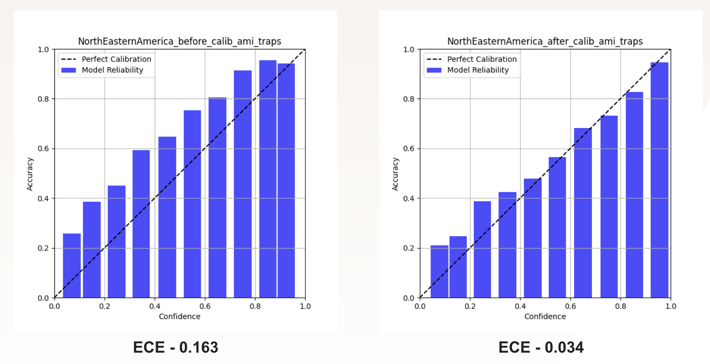
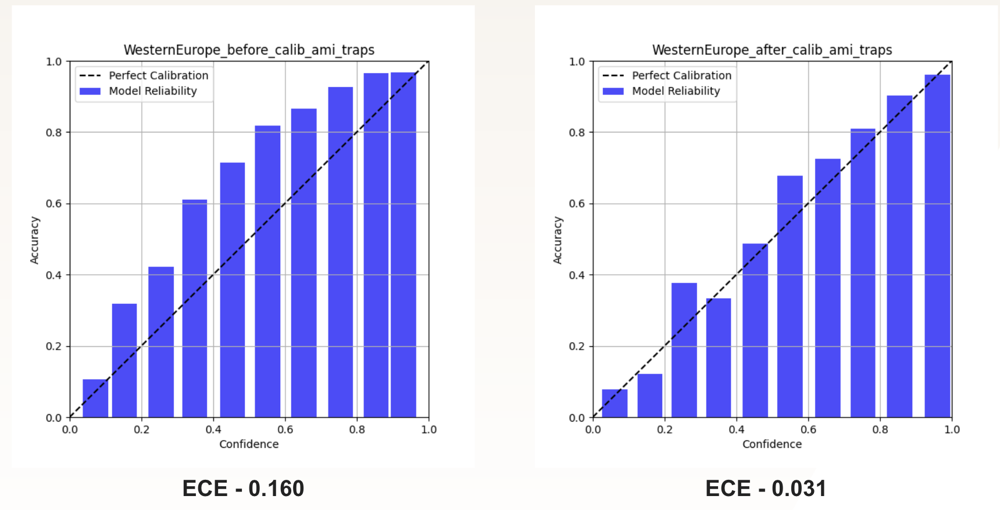
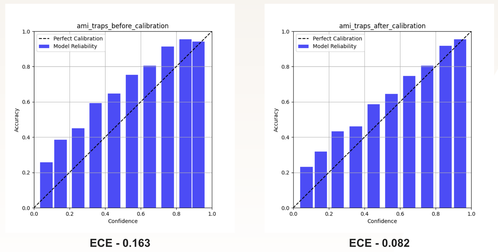

## Confidence Calibration
Research and experiments on confidence calibration. This calibrates the model's prediction confidence to better reflect the ground truth. The script `temperature_scaling.py` calibrates the model on AMI-GBIF validation set and then evaluates the scaling on AMI-GBIF test set and AMI-Traps dataset.

### Results
The results of confidence calibration is evaluated using Expected Calibration Error (ECE).

#### North-Eastern North America
T (temperature scaling parameter) = 0.8428

#### Western Europe
T = 0.8434

#### Global Model
T = 0.9208

For more details, please refer to the presentation slides.
