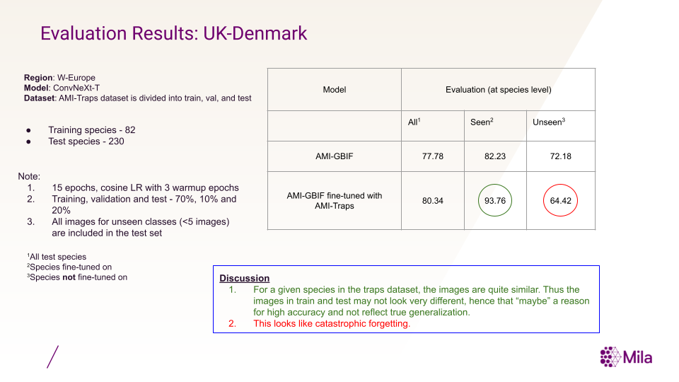
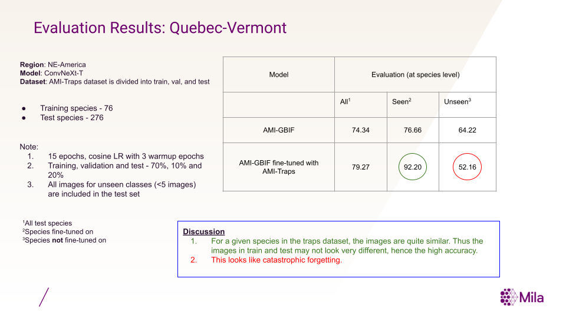

## Fine-tuning with insect camera trap data
Research and experiments for fine-tuning GBIF-trained models with insect camera trap data.

### Dataset Preparation
1. The AMI-Traps dataset is read and structured with taxon keys as folders with its corresponding images for the specific region. (`convert_to_ml_dataset.py`)
2. Create dataset splits. (`create_dataset_splits.py`)
3. Convert to webdataset format. (`convert_to_webdataset.py`)

### Model Training
The training is done using the model training scripts in `src/classification`. 

### Model Evaluation
The `evaluation.py` evaluates the original and the fine-tuned AMI-GBIF models on the test set. Below shows fine-tuning results for two regions: Quebec-Vermont and UK-Denmark.

