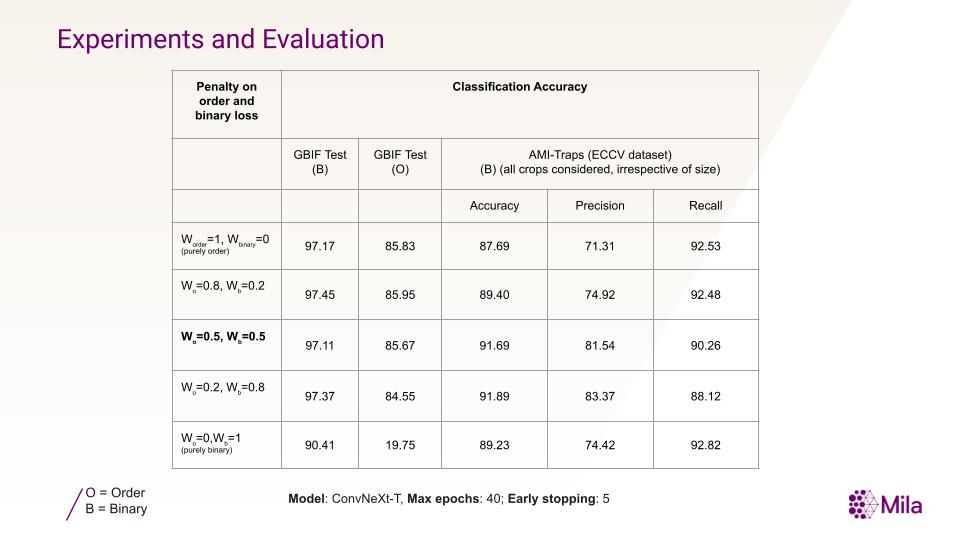

# Insect Order Classifier
Research and development of a vision model to classify specific insect orders (and two of Arachnida), with a custom-designed loss function.

## Taxonomic groups
The following orders are included in the model: 

- Lepidoptera
- Diptera
- Hemiptera
- Odonata
- Coleoptera
- Araneae (class Arachnida)
- Orthoptera
- Hymenoptera (Ichneumonidae, Formicidae, Braconidae, Andrenidae, Apidae, Colletidae, Halictidae, Megachilidae, Melittidae, and Stenotritidae only)
- Trichoptera
- Neuroptera
- Opiliones (class Arachnida)
- Ephemeroptera
- Plecoptera
- Blattodea
- Dermaptera
- Mantodea

## GBIF data
The models are trained using data fetched from GBIF. Multiple darwin core archives were requested to fit the file in memory and parallelize data download.

- Lepidoptera: GBIF.org (14 December 2024) GBIF Occurrence Download  https://doi.org/10.15468/dl.n3zcat
- Plecoptera: GBIF.org (14 December 2024) GBIF Occurrence Download  https://doi.org/10.15468/dl.6576q9
- Rest: GBIF.org (09 December 2024) GBIF Occurrence Download  https://doi.org/10.15468/dl.hsxw84

## Loss-function
The models are trained with a weighted combination of two cross-entropy loss functions:

$$ Loss = p*L_{binary}+ (1-p)*L_{order} $$

$L_{binary}$ penalizes on moth / non-moth classification while $L_{order}$ does it for the order level. The parameter `p` controls the penalty on the two losses.

## Model training and evaluation
Multiple ConvNeXt-T models are trained for different values of `p`. They are evaluated for binary (moth / non-moth) and order classification on GBIF test and AMI-Traps dataset.

