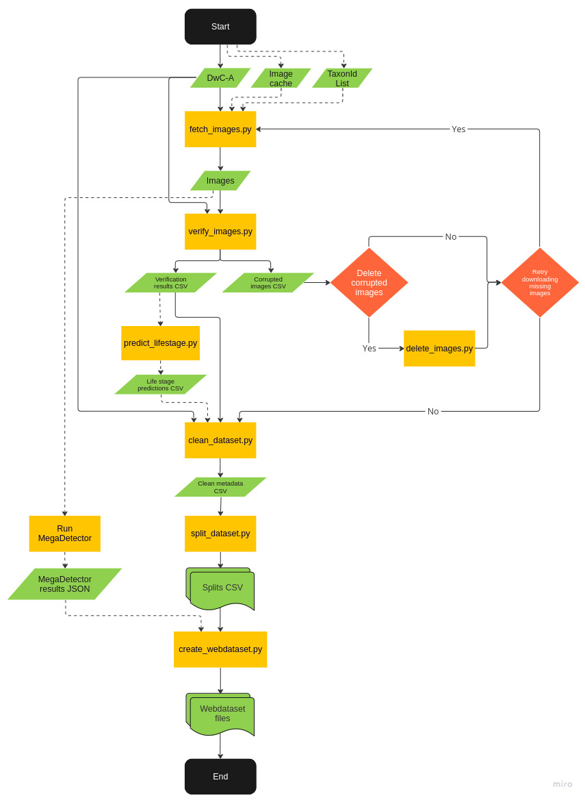

# Assembling webdatasets

Please refer to
the [documentation](https://docs.google.com/document/d/1JMbU7exXyaJicldYBgMszY6hgy1J22dCki-TOEgYE0o/edit?usp=sharing)for
a detailed description of the pipeline for assembling training datasets
using GBIF data.

## Overview

Here is an overview of the commands available in this folder.

You must install the package beforehand using following the instructions of the
root [README](../../README.md#setup).

Alternatively, the package can also be installed directly with pip if the repository is
not local to your machine:

`pip install git+https://github.com/RolnickLab/ami-ml.git`

| CLI Commands                    | function                                                                                  | multijob* | multiprocess** |
|---------------------------------|-------------------------------------------------------------------------------------------|-----------|----------------|
| `ami-dataset fetch-images`      | Download images from URLs in observation metadata from a Darwin Core Archive (DwC-A) file | Yes       | Yes            |
| `ami-dataset verify-images`     | Check images for errors                                                                   | No        | Yes            |
| `ami-dataset delete-images`     | Delete a list of images                                                                   | No        | No             |
| `ami-dataset predict-lifestage` | Predict life stage for moths                                                              | No        | Yes            |
| `ami-dataset clean-dataset`     | Filter out images to ensure the quality of the training data                              | No        | No             |
| `ami-dataset split-dataset`     | Split dataset into training/validation/test sets                                          | No        | No             |
| `ami-dataset create-webdataset` | Assemble final training set in webdataset format                                          | No        | No             |

*The command can be run using multiple Slurm job instances in parallel for faster execution.

**The command can use multiple processes for faster execution. Use the Slurm directive `--cpus-per-task` to define the
number of processes per node and set the option `--num-workers` in the command.

<br/>

The purpose and use of each command is detailed in its docstring. Command options can be listed
directly in the CLI with the `--help` flag.

For the CLI itself and to have an overview of the commands

```bash
ami-dataset --help
```

For a specific command

```bash
ami-dataset fetch-images --help
```

## Pipeline description

The figure below shows a diagram demonstrating the webdataset creation pipeline given a Darwin Core Archive file as the
source, including intermediate files produced by each process. Dashed lines indicate optional processes.



### Downloading images

**DwC-A**: The only required input for the `fetch-images` command is a DwC-A file that contains the observations to
be fetched. DwC-A files can be generated using
the [GBIF occurrence search tool](https://www.gbif.org/occurrence/search). After selecting a set of filters, GBIF will
generate a versioned dataset with a DOI ([example](https://www.gbif.org/occurrence/download/0004611-230828120925497)).

**TaxonId List**: In some cases, the list of species is too large to be selected using the online GBIF tool. In such
cases, you can use a DwA-A file containing all occurrences at a higher rank, such as families. To avoid fetching images
from species outside of the list of interest, provide a JSON file containing a list of the species IDs using
the `--subset-list` option. To select a field for filtering occurrences to be fetched, use the `--subset-key` option,
which by default uses `acceptedTaxonKey`. To look up GBIF IDs for a species list, you can use
the [GBIF’s online tool](https://www.gbif.org/tools/species-lookup). JSON Example:

```json
[
  1880083,
  1889838,
  9051758
]
```

**Image cache**: The command also supports using a cached folder to copy previously downloaded images.

This command is multijob. Multiple Slurm instances can be used to fetch images in parallel. Ensure you set the same
shared folder for all jobs using the `--dataset-path` option.

For each occurrence, the command will try download all images available, not only the first one. As the taxonomic
information is subject to change, the command does not use any name from the taxonomic classification. Images are saved
using the `datasetKey` as a subfolder and the `occurenceID` as the filename. If an occurrence has more than one image, a
counter is added, example: `50c9509d-22c7-4a22-a47d-8c48425ef4a7/3018072584_2.jpg`.

### Check images for errors

The `verify-images` command uses the DwC-A to verify if images were correctly downloaded to the target folder,
checking for corruption. It also retrieves information such as image size and file datetime. The verification info
for the valid images is saved to a CSV file. The command also provides a CSV with the list of all images with errors
that
can be deleted using `delete-images.`.

### Cleaning and spliting the dataset

The cleaning command (`clean-dataset`) applies a series of operations to ensure the quality of the dataset.
Please refer to the `--help` flag for details. The command requires the DwC-A file and the CSV generated by the error
verification command, and it produces a CSV file with all the information required to create a webdataset. One of the
cleaning options is to remove non-adult images based on the life stage tag. However, this tag may not be available for
many images. A life stage classifier can be used to generate this information (see `predict-lifestage`).

The `split-dataset` command splits the CSV into train/val/test partitions. Use the options `--val-frac` and
`--test-frac` to determine the amount of data to be used. Use the `--max-instances` to undersample the majority classes
to a maxinum value; the default is 1000. By default, images belonging to the same occorrence will be kept on the same
partition; set the `--split-by-occurrence` option to false to ignore this behavior.

### Generating the webdataset

Use the CSV generated in the previous step as the source (`--annotations-csv`) to create the webdataset using the
`create-webdataset` command. Select the CSV columns for the label (`--label-column`) and the image path
(`--image-path-column`) in the folder (`--dataset-dir`) that contains the downloaded images. Other columns from the
CSV — such as date, latitude, and longitude — can be saved to the webdataset using a JSON file, use the
`--columns-to-json` option for this purpose.

Define the output patern for the tar files using the `--webdataset-patern` option (for example:
`"/home/mila/f/f/scratch/wbds/val-%06d.tar"`). Use double quotes to avoid shell expansion of the expression before
pass it to the command.

Use the `--category-map-json` option to provide the mapping between the CSV category ID and the model class ID.
If not provided the command will infer from annotations and this map can be saved using the `--save-category-map-json`
option. One common use is to automatically generate the category map for the training set and then use it for the
others splits.

The command also supports cropping images to the bounding box generated by MegaDetector. Use the
`--megadetector-results-json` option to provide the MegaDetector results file. To run MegaDetector, please refer to
its official [documentation](https://github.com/microsoft/CameraTraps/blob/main/megadetector.md).
